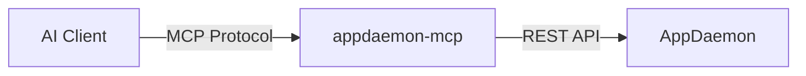

# AppDaemon MCP Server

[](https://pypi.org/project/appdaemon-mcp/)
[](https://opensource.org/licenses/MIT)
[](https://github.com/yourusername/appdaemon-mcp/actions)

An [MCP (Model Context Protocol)](https://modelcontextprotocol.io/) server that wraps the [AppDaemon](https://appdaemon.readthedocs.io/) REST API. This allows AI assistants (like Claude, Cursor, and ChatGPT) to observe, manage, and develop AppDaemon home automation apps programmatically.



## Features

- **App Management**: List, start, stop, restart, enable, disable, create, and remove apps.
- **State Observation**: Retrieve states for entire namespaces or specific entities.
- **Service & Events**: Call any AppDaemon service or fire custom events.
- **Logging**: Access live AppDaemon logs for real-time debugging.
- **Modern Stack**: Built with Python 3.10+, `uv`, and `FastMCP`.

## Prerequisites

- **Python 3.10+**
- **AppDaemon**: A running instance with the [HTTP component enabled](https://appdaemon.readthedocs.io/en/latest/CONFIGURE.html#http).

## Quick Start (No Installation Required)

You can run the server directly using `uvx` (part of the [uv](https://github.com/astral-sh/uv) package manager):

```bash
export AD_URL="http://192.168.1.20:5050"
export AD_API_KEY="your_api_password"
uvx appdaemon-mcp
```

## Installation

### Using `uv` (Recommended)

```bash
uv tool install appdaemon-mcp
```

### Using `pip`

```bash
pip install appdaemon-mcp
```

## Configuration

The server is configured entirely via environment variables:

| Variable        | Required | Default | Description                                                |
| --------------- | -------- | ------- | ---------------------------------------------------------- |
| `AD_URL`        | **Yes**  | —       | AppDaemon base URL, e.g. `http://192.168.1.20:5050`        |
| `AD_API_KEY`    | No       | —       | API password (if `api_password` is set in AD config)       |
| `AD_APPS_DIR`   | No       | —       | Path to AppDaemon `apps/` directory (enables dev tools)    |
| `AD_CONFIG_DIR` | No       | —       | Path to AD config directory (enables config resources)     |
| `AD_VERIFY_SSL` | No       | `true`  | Set to `false` to skip SSL verification                    |
| `MCP_TRANSPORT` | No       | `stdio` | `stdio` for IDE integrations, `streamable-http` for remote |

## Client Configuration

### Claude Desktop

Add this to your `claude_desktop_config.json`:

```json
{
  "mcpServers": {
    "appdaemon": {
      "command": "uvx",
      "args": ["appdaemon-mcp"],
      "env": {
        "AD_URL": "http://192.168.1.20:5050",
        "AD_API_KEY": "your-secret"
      }
    }
  }
}
```

### Cursor / VS Code (via IDE extension)

Configure the MCP server with the following:
- **Command**: `uvx appdaemon-mcp`
- **Environment Variables**:
  - `AD_URL`: Your AppDaemon URL
  - `AD_API_KEY`: Your API password

## Docker Usage

The official image is available on GHCR:

```bash
docker run -e AD_URL="http://192.168.1.20:5050" ghcr.io/yourusername/appdaemon-mcp:latest
```

## Available Tools

### Core & Observation
- `ad_get_info`: Get AppDaemon system information (version, timezone, etc.).
- `ad_get_state`: List states in a namespace.
- `ad_get_entity`: Get state of a specific entity.
- `ad_get_logs`: Retrieve recent AppDaemon log entries.

### App Management
- `ad_list_apps`: List all registered apps and their current status.
- `ad_get_app_info`: Get detailed configuration and status for a single app.
- `ad_start_app` / `ad_stop_app`: Start or stop a specific app.
- `ad_restart_app`: Restart an app.
- `ad_enable_app` / `ad_disable_app`: Toggle whether an app is enabled.
- `ad_reload_apps`: Instruct AppDaemon to reload apps from disk.
- `ad_create_app`: Create a new app (requires `AD_APPS_DIR` for file creation).
- `ad_remove_app`: Remove an app.

### Services & Events
- `ad_list_services`: List available services.
- `ad_call_service`: Call a service (e.g., `light/turn_on`).
- `ad_fire_event`: Fire a custom event in AppDaemon.

## Development

```bash
# Clone the repository
git clone https://github.com/yourusername/appdaemon-mcp.git
cd appdaemon-mcp

# Install dependencies and setup environment
uv sync

# Run tests
uv run pytest

# Lint and format
uv run ruff check .
uv run ruff format .
```

## License

MIT
